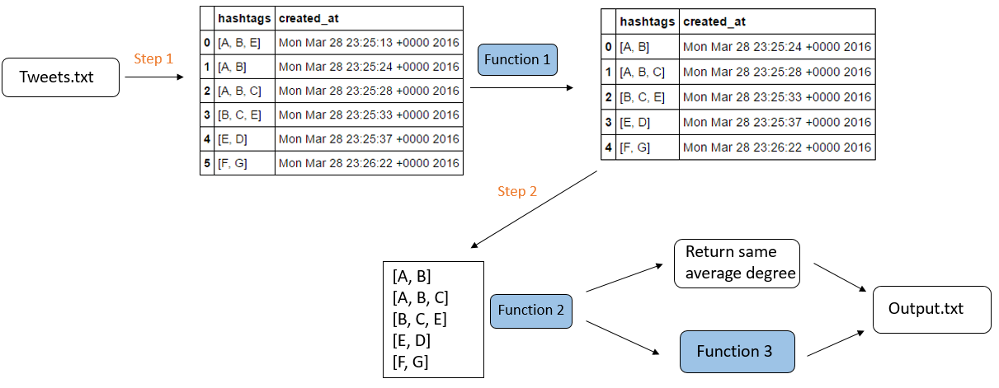

## Insight Data Science Coding Challenge Final
***Hsin-Ju (Michael), Tung - ChemE Grad at University of Washington***

                       
### Description

This is insight data science coding challenge. In this challenge, it requires you to:

"Calculate the average degree of a vertex in a Twitter hashtag graph for the last 60 seconds, and update this each time a new tweet appears.  You will thus be calculating the average degree over a 60-second sliding window."

The detail challenge instruction can see [here][1]

I wrote it in Python language to slove this challenge. The following will show the workflow and methods I used to slove this problem. To execute it, you can simply run `./run.sh` from the command line.


### Tweeter hashtag graph example

----


----


### Software dependencies

**All the required software is open source.**  The implementation was done using the following language and packages.

**Programming language:**   
Python version 2.7  ([https://www.python.org/](https://www.python.org/))

**Python packages needed:**
- NumPy 1.10.4
- pandas 0.18.0
- matplotlib 1.5.1 (For plotting)
- Networkx 1.11 (To generate network plot)


### Workflow and Methods

The data showing here are just example to illustrate my algorithm

----



----

**Step 1** 

Read one tweet from the input file each time, convert the data to the data structure that only contains the hashtags and created time information, shown as in the diagram, and store it. 

**Function 1** 

Find the maximum and the minimum time from that data sets, remove the minimum time data if `max_time - min_time` > 60 seconds, loop over until `max_time - min_time` <= 60 seconds. (Inclusive)

 **Step 2** 

Now we have data sets that are within 60 seconds time window. Extract the hashtags from there and do the average degree calculation.


**Function 2** 

To make the program more efficient, if the new hashtags are same as previous hashtags then return the same average degree value. If they are not, then do the average degree calculation. 
**Note**: the hashtags mentioned here are the stored hashtags that within 60 seconds timewindow. 


**Function 3**


I use the matrix to calculate the average degree of hashtags graph. Any two hashtags form the edges will assign 1 in their corresponding position in the matrix. If they already form the edges before, that position will still be 1, shown as above. For example, in this case, the edges in the graph  are:

```
#A <-> #B

#A <-> #B
#B <-> #C
#C <-> #A

#B <-> #C
#C <-> #E
#E <-> #B

#E <-> #D

#F <-> #G

```
Then we can fill half matrix, the other half will be symmetric. Since A connect to B, B also connect to A. The edges counts of each node are the sum of that column. 

Average Degree = (2+3+3+1+3+1+1) / 7 = 2.00


**Clarification**
- If the hashtag is empty for that tweet, it will be not accounted for this matrix calculation. 
- If the tweet has only one hashtag, it will be not accounted for this matrix calculation.
- If all tweets are empty hashtag **or** all are one hashtag in that 60 seconds time window, then average degree will return 0.


**Plotting**
- Use python package **Networkx** to generate the network plot.
- The script `network_plot.py` reads the data after step2 (above) and plot the graph.
- The plotting setting should be manually changed. 


### Directory structure


	├── README.md 
	├── run.sh
	├── images
	│   └── network_plot.py
	│   └── Workflow.PNG
	│   └── Matrix example.PNG
	│   └── Example hashtag graph.png
	├── src
	│   └── average_degree.py
	├── tweet_input
	│   └── tweets.txt
	│   └── tweets_2.txt
	├── tweet_output
	│   └── output.txt
	│   └── output_2.txt
	└── insight_testsuite
	    ├── run_tests.sh
	    └── tests
	        └── test-2-tweets-all-distinct
	        │   ├── tweet_input
	        │   │   └── tweets.txt
	        │   └── tweet_output
	        │       └── output.txt
	        └── your-own-test
	            ├── tweet_input
	            │   └── tweets.txt
	            └── tweet_output
	                └── output.txt


[1]: https://github.com/hsintmike/InsightDataScience/blob/master/instruction.md "here"